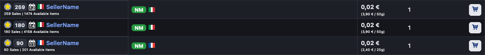

# cm-userscripts
- Userscripts for making Cardmarket nicer to use

## Installation

Have a userscript runner installed, add the scripts
- [Tampermonkey](https://www.tampermonkey.net/) browser extension
- [Userscripts](https://apps.apple.com/us/app/userscripts/id1463298887) iOS application

## Scripts

### CM_Offers_UI
- Rewrites whole Cardmarket offers table into a more readable version with images
- 

### CM_Offers_Feed
- Requires *CM_Offers_UI* to be installed
- Replaces pagination by automatically loading the next page of offers
- Loads the next page in a hidden iframe and points the UI to use the iframe elements
- *Note:* Adding a product into the cart via an iframe element will not update the cart badge number even though adding to cart succeeds
- 

### CM_Shipping_Estimate
- Displays shipping estimate for sellers on the singles page
- *Note:* Does not account for custom shipping options provided by professional sellers
- 
